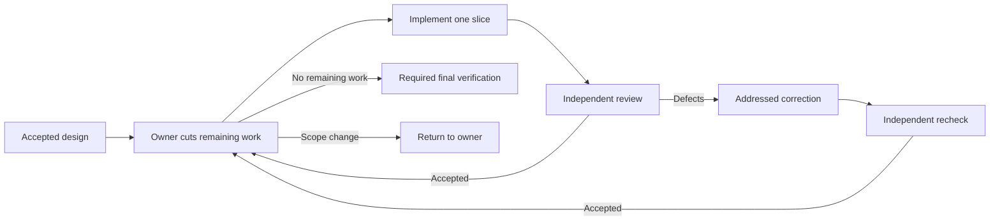

# Locus Pi workflows

Create a readable graph of agents for a real task. The default implementation style works through reviewable slices and revises the remaining plan after each slice. [Run and inspect workflows](workflows.md) covers commands, evidence and recovery.

## Create a workflow

Ask Pi to author a workflow for a task directory:

```text
Create a workflow for .tasks/example. Use adaptive slices and outcome-led briefs.
Build the source, but do not run it. Keep an owner pause between design and implementation.
```

The author writes and reviews a `.design.md` file, builds the declared
`.workflow.mjs` entries, and checks their source. Building creates the program;
it does not execute its agents. Ask for `design only` to stop before source is
built. The task directory is the entry context; agents find `task.md`, the
accepted design and relevant artifacts inside it.

The authoring `.design.md` describes the workflow graph. In the adaptive references,
the design entry later produces the task-change proposal in `artifacts/design.md`.
The owner accepts that proposal before launching the separate implementation entry;
these are two entries and two runs. A successful design run means the proposal is
ready for the owner, not that implementation is authorized.

### Choose a graph and prompt detail

For substantive implementation, the default is an adaptive slice queue:



The owner revises remaining work after each accepted slice. Later agent calls
therefore depend on discovered work and actual results. A cumulative slice limit
stops repeated re-cutting from running forever. A correction is followed by a
fresh check. Failed or missing required verification cannot become a successful
result by dropping a report.

Use a **fixed graph** for known, unchanging work or ask for it explicitly.
Choose **procedural briefs** only when an exact sequence is required by a tool or
an observed failure. The default **outcome-led brief** names the role, result,
sources and essential constraints, then leaves the method to the agent. Graph
shape and brief detail are separate choices. Neither declares a model tier.

### Set a size preference

State the desired scale in the authoring request, for example:

```text
Prefer a small graph. Keep the independent review and required verification.
Show the worst-case agent calls and explain if the task requires more.
```

This is advice to the author. Locus Pi has no `workflowSizeGuideline` setting or
`small`/`medium` runtime switch. The reviewed design records concrete slice and
correction bounds; existing runtime attempt and concurrency limits are separate.
Never remove required work to meet an advisory size preference.

Claude Code's **Dynamic workflow size** setting uses `workflowSizeGuideline`:
`small` aims below 5 agents, `medium` below 15, `large` below 50, and
`unrestricted` sends no guideline. Its default is `medium`. This controls an
advisory agent count, not prompt length or reasoning effort. See the
[Claude Code size guide](https://code.claude.com/docs/en/workflows#set-a-size-guideline).

### Use the references

The [adaptive pattern](../skills/locus-pi-workflow-create/references/adaptive-slices.md)
links executable design and implementation examples. They are teaching sources,
not names installed in the Package command catalog. Copy and adapt them into
`.locus-pi/workflows/<name>/` through the authoring skill. Match filenames,
`meta.name` and the reviewed design's entries before running.

After installing the example as `adaptive-slices`, run it from the target
repository with a task directory and an explicit output workspace:

```text
/workflows run adaptive-slices --output-dir .tasks/example/artifacts/implementation -- .tasks/example
```

Pi's `input` is one semantic string, not an `args` object. The current repository
establishes the execution context, the input identifies the task directory, and
`--output-dir` selects the workflow workspace. Naming another repository in a
prompt does not switch the child working directory. Use a fresh workspace for
an independent run.

### Choose executors

Keep responsibility names such as implementer and reviewer distinct from model
names. The global user model table resolves `modelRole`; a concrete `model` is an
explicit override. If an exact assigned role is required, `requireModelRole`
fails when it is unassigned. Otherwise fallback to the parent model is recorded.
Check the executed model in the run evidence before claiming Claude/Codex
independence. Configure routes through `/model-roles` or `~/.pi/agent/model-roles/config.json`; project-local model-role files are not read. No automatic load-based engine scheduler is added by this pattern.

### Return a result and continue

A workflow returns its result and evidence. A `next_command` field is a manual
suggestion; it does not execute another workflow or authorize implementation.
The design reference returns the reviewed proposal to the owner. The owner
accepts that exact design revision before starting the implementation entry.
A nonempty acceptance path is insufficient; the first implementation agent reads
and checks the actual acceptance evidence.

For a host-managed question, `awaitOperator` declares a pause and the source
returns immediately. The host starts a new run after a real answer and verifies
its continuation artifacts. This is separate from manual cross-workflow handoff
and from `invokeWorkflow`, which actually invokes a saved child with runtime-owned
checkpoint semantics. Choose the mechanism needed by the design; never run a
child across an unresolved owner decision. See [continuation](../extensions/workflows/references/recovery-and-continuation.md).

## Authoring references

The installed [workflow-create skill](../skills/locus-pi-workflow-create/SKILL.md) owns Design → review → Build. The [workflow-run skill](../skills/locus-pi-workflow-run/SKILL.md) owns execution and recovery. Read the [source boundary](../skills/locus-pi-workflow-create/references/source-boundary.md) before building and the [exact source contract](../extensions/workflows/references/source-shape.md) when resolving checker diagnostics.
