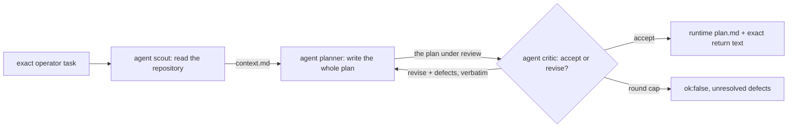

# Planning and implementation, as two workflows

`plan` turns one operator task into an accepted implementation plan.
[`plan-implement`](../plan-implement/) carries that plan out. They are two
workflows on purpose: planning is read-only and cheap to repeat, implementation
writes to the operator's checkout, and the operator decides — by launching the
second one — whether a plan is worth executing.

Both are **Package workflows**: they live in `extensions/workflows/examples/`,
which the resolver scans, so `/workflow-run plan "<task>"` and
`/workflow-run plan-implement "<request>"` resolve without any project file, and
both ship in `package.json#files` and `public-repository.json`. Workflow
JavaScript is trusted local code with full Node.js host access; it is not
sandboxed. `plan` is read-only end to end, `plan-implement` writes to the launch
checkout, and that difference is why they are two workflows rather than one.

```text
plan/
├── README.md
├── plan.workflow.mjs
└── plan-pipeline.svg

plan-implement/
├── README.md
└── plan-implement.workflow.mjs
```

[`plan-pipeline.svg`](./plan-pipeline.svg) is the picture of the run below: the
three agents down the middle with what each one receives and returns, the script
phase that owns each of them on the left, the persisted artifacts on the right,
and both ways the run can end. It is hand-authored and edited directly — there is
no generator, and nothing regenerates it.


There are no prompt resources and no workflow-local agent definitions. Every
stage task is written inline under one `COMMON` contract, because no prompt here
is long enough to bury the routing — the [authoring rule](../../AUTHORING.md) and
the shipped counts are in [`../README.md`](../README.md).

## `plan`: three agents, one loop



The cast is declared once, in the frozen `PLAN_AGENTS` roster at the top of the
file: each entry carries the agent's id, what it receives, what it returns, and
its capability options, and every call site spreads those options and adds only
the round label. Reading that object tells you who takes part without following
the control flow that calls them.

**`scout` describes; it never proposes.** It is the only stage that reads the
repository broadly, so the loop below never has to go looking: existing
behaviour, the surfaces a change would touch, the conventions it would have to
follow, and an explicit list of what it could not determine.

**`planner` writes the whole plan every round, never a delta**, so the workflow
never merges two model documents. Rounds share the `plan.md` name: the artifact
id is the index identity, so every round is retained separately and the last one
is the plan.

**`critic` is the exit.** It reopens the repository, checks each step against
what is actually there, and returns the shaped `{verdict, defects}`. Script code
branches on the enum and hands the defect sentences to the next round verbatim,
numbered. It never greps the draft's Markdown.

### The run never stops to ask

There is no operator pause and no clarification round. When the task leaves a
real choice open, the planner takes the most defensible option and records it in
the plan under `## Assumptions`, in the form "assumed X, because Y; wrong if Z";
the critic treats a decision the plan depends on but never states as a defect,
and a choice recorded with its reason as not a defect even when it would have
chosen differently.

That is a deliberate trade. A run that halts to ask has to be resumed, and until
it is there is no plan at all; an assumption written down is visible to the
operator the moment the run finishes, and correcting it means replanning — which
this workflow is cheap enough to do.

The measured exit is the critic. `MAX_PLAN_ROUNDS` (4) is only the safety net, and
reaching it is a failure — `{ ok: false, stoppedBy: "round-cap", unresolvedRows }`
carrying the critic's last defects. That is deliberate: a draft nobody accepted is
not a plan, and a failed run projects no terminal artifact, so an unaccepted draft
cannot be handed to a writer.

### What the run retains

- `task.md` — the exact operator task, byte for byte;
- `context.md` — the scout's map;
- one `plan.md` and one `plan-critique.json` per drafting round;
- the returned text, equal to the accepted `plan.md`.

## `plan-implement`: one writer per step

```mermaid
flowchart LR
    P["verified plan.md reference"] --> S["host: parse ## Steps blocks"]
    S --> L["no-tool selector: which steps, with notes"]
    L --> V["workflow: validate ids, restore plan order"]
    V --> R["resolve implementation scope (read-only)"]
    R --> W1["writer: step S1"]
    W1 --> W2["writer: step S2"]
    W2 --> E["collect check evidence (read-only + repository_check)"]
    E --> Q["fresh reporter (read-only)"]
    Q --> O["runtime implementation-report.md"]
```



The plan arrives as continuation bytes the host has already verified and copied,
never as text pasted into the input. The entry requires exactly one continuation
artifact named `plan.md`, bounds it, and reads it. It used to re-derive the
host's proof as well — matching digests, the source run's target and stage, and
its terminal result — and that ceremony was removed on 2026-07-28: it sat in
front of every reader for a risk worth less than its cost, since the worst case
is implementing a plan the critic had not accepted, which replanning fixes.

Deterministic code then parses the `### S<n>` blocks. That text was written by a
_previous_ run's agent, so a malformed plan is a fatal error: nobody in this run
can be re-asked for it. Everything the current run's selector can repair —
choosing ids that exist, staying inside the note budget — is a schema keyword or a
`validate` callback instead, and is re-asked rather than fatal.

The selector may implement a subset when the operator asked for one, but the
**plan's own order is authority**: `orderStepSelection` restores it regardless of
the order the selector listed. Each writer receives exactly one step block, its
operator note, the shared scope, and its predecessors' results.

A failing writer stops the remaining steps — plan steps are ordered because each
builds on the last, and running the rest on top of a failure is how a plan
half-lands — but it does not stop the run. The checker and the reporter still run,
because the operator's working tree has already changed and needs describing, and
the run returns `{ ok: false, partial: true, appliedSteps, failedStep,
unresolvedRows }`. The runner projects a deliberate partial as a non-success.

`captureSourceState()` fingerprints the checkout before and after every writer, so
the reporter can separate what a declared writer window changed from drift that
appeared outside one. It records evidence; it does not lock the checkout.

### What the run retains

- `step-selection.json`, `scope.md`, one `worker-S<n>.md` per attempted step,
  `check-evidence.md`, and `implementation-report.md`;
- `source-state-*.json` fingerprints around every writer and check window;
- the returned text, equal to `implementation-report.md`, unless the run was
  partial — then the returned value is the structured envelope above and the
  report is still retained.

## Capability boundary

Capability policy lives in the workflow scripts, not in prompt prose. Every stage
of `plan` passes `readOnly: true`, which the host enforces by removing shell,
write/edit, nested workflow, and unknown tools — planning cannot change the
repository. In `plan-implement` only the per-step writers hold `write`, `edit`,
and `bash`; the selector has no tools at all, and the scope, check, and report
stages are read-only. The check stage additionally receives `repository_check`,
which runs an existing `package.json` script in a disposable host-created
worktree with host-owned argv, timeout, and cleanup.

Neither workflow commits, pushes, stages, stashes, or touches a remote.
