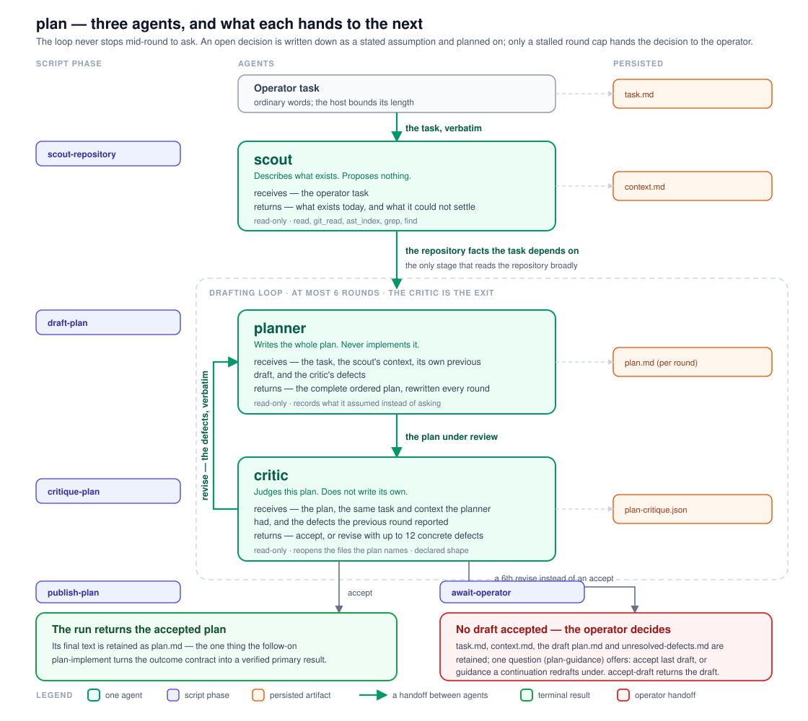
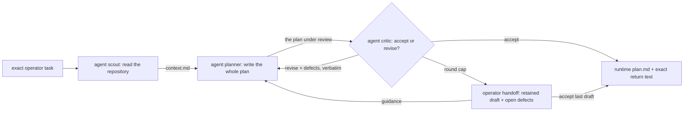
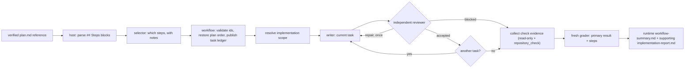

# Planning and implementation, as two workflows

`plan` turns one operator task into an accepted implementation plan.
[`plan-implement`](../plan-implement/README.md) carries that plan out. They are two
workflows on purpose: planning prompts forbid edits and cheap to repeat, implementation
writes to the operator's checkout, and the operator decides — by launching the
second one — whether a plan is worth executing.

Both are **Package workflows**: they live in `extensions/workflows/examples/`,
which the resolver scans, so `/workflows run plan "<task>"` and
`/workflows run plan-implement "<request>"` resolve without any project file, and
both ship in `package.json#files` and `public-repository.json`. Workflow
JavaScript is trusted local code with full Node.js host access; it is not
sandboxed. `plan` agents are instructed not to edit, `plan-implement` writes to the launch
checkout, and that difference is why they are two workflows rather than one.
Every stage in this pair declares `modelRole: "agent"` and names no provider.
A packaged workflow must run on the host it lands on, and a concrete
`provider/id` fails the stage by name for everyone who does not have that exact
model — so the pair names the tier and the operator answers it: `/model-roles` →
`AGENT` assigns the model and its effort. Until something assigns it, the stage
runs on the current session model and the run evidence records the degradation.
Pin a concrete model only in a workflow you keep to yourself.

```text
plan/
├── README.md
├── plan.workflow.mjs
└── plan-pipeline.svg

plan-implement/
├── README.md
└── plan-implement.workflow.mjs
```

[`plan-pipeline.svg`](./plan-pipeline.svg) is the picture of the run below: the
three agents down the middle with what each one receives and returns, the script
phase that owns each of them on the left, the persisted artifacts on the right,
and both ways the run can end. It is hand-authored and edited directly — there is
no generator, and nothing regenerates it.



There are no prompt resources and no workflow-local agent definitions. Every
stage task is written inline under one `COMMON` contract, because no prompt here
is long enough to bury the routing — the [authoring rule](../../AUTHORING.md) and
the shipped counts are in [`../README.md`](../README.md).

## `plan`: three agents, one loop



The cast is declared once, in the frozen `PLAN_AGENTS` roster at the top of the
file: each entry carries the agent's id, what it receives, what it returns, and
its capability options, and every call site spreads those options and adds only
the round label. Reading that object tells you who takes part without following
the control flow that calls them.

**`scout` describes; it never proposes.** It is the only stage that reads the
repository broadly, so the loop below never has to go looking: existing
behaviour, the surfaces a change would touch, the conventions it would have to
follow, and an explicit list of what it could not determine.

**`planner` writes the whole plan every round, never a delta**, so the workflow
never merges two model documents. Rounds share the `plan.md` name: the artifact
id is the index identity, so every round is retained separately and the last one
is the plan. It starts with an explicit `## Outcome` contract: outcome type,
primary result, consumer, form and location, required content or behavior,
usability proof, and supporting evidence. The steps are then derived from that
result rather than treated as the result themselves.

**`critic` is the exit.** It reopens the repository, checks each step against
what is actually there, and returns the shaped `{verdict, defects}`. Script code
branches on the enum and hands the defect sentences to the next round verbatim,
numbered. It never greps the draft's Markdown.

**Each round ratchets instead of relitigating.** The critic receives the defects
it reported on the previous draft and judges in that order: is each one closed
or answered under `## Critique responses` with evidence, and does any NEW defect
meet the bar of making an implementer stop, guess, or do the wrong thing? A
critic that finds a different complaint each round on a part that did not change
is the way this loop fails without producing a plan, so the prompt names that
failure and forbids it.

### The loop never stops to ask

There is no operator pause mid-loop and no clarification round. When the task
leaves a choice open and one interpretation is clearly safer, the planner takes
it and records it in the plan under `## Assumptions`, in the form "assumed X,
because Y; wrong if Z". An ambiguity that changes the primary result remains an
open question instead of being silently narrowed. The critic rejects an
unstated decision and also rejects a plan whose steps can pass without producing
the declared result.

That is a deliberate trade. A justified assumption stays visible and is cheap to
correct by replanning. A meaning-changing ambiguity cannot produce an accepted
plan; if the loop cannot resolve it, the existing round-cap handoff asks the
operator to accept the retained draft or provide guidance.

### The round cap hands the decision to the operator

The measured exit is the critic. `MAX_PLAN_ROUNDS` (6) is the safety net, and
reaching it means the loop stalled: a draft nobody accepted is not a plan, and
the run returns none. What it no longer does is burn the run. The scout's map
and six rounds of drafting are paid for, so the run publishes the exact stalled
state — `task.md`, `context.md`, the last `plan.md`, `unresolved-defects.md` —
and declares an operator handoff with one question. The oldest pending question
opens in the editor when Pi is idle; the `/workflows` menu's `continue` entry
reopens it, or typed `/workflows continue <runId>` names it directly.

All four refs are published together, immediately before the handoff — including
a second copy of the task the run already published at its start. The handoff
requires every ref to be inside the run's terminal artifact projection, which
keeps only the newest 20 outputs, and a stage that re-asks a child on a schema
rejection writes an artifact per attempt: a few re-asks were enough to evict a
ref published at the start and fail the run on its very last step, after paying
for every round. Publishing them together makes them the newest four whatever
the run did before.

The question is a **select with one option and free text allowed**, not a plain
text prompt: the accept decision has exactly one exact answer, and a prompt that
merely quoted the phrase invited a near-miss — "accept the last draft", a
trailing period, the quotes themselves — which would have become drafting
guidance and quietly spent another twelve agent calls.

The operator has exactly two moves, and both are recorded:

- **`accept last draft`** (the offered option, matched case-insensitively) — the
  retained draft becomes the accepted plan. That is the operator overruling the
  critic, which is their authority; the continuation run logs the override,
  republishes the plan as its own, and returns the draft text like any accepted
  plan.
- **anything else is drafting guidance** — the continuation run re-enters the
  drafting loop seeded with the retained draft and its open defects, without
  re-scouting. Both roles receive the guidance verbatim and are told it outranks
  earlier defects where they conflict: the planner follows it, and the critic may
  not count a choice the guidance made as a defect. A continuation that stalls
  again declares the same handoff again.

A dead `ok:false` run at the cap used to be the outcome, and it forced the
operator to start over from nothing — replan, re-scout, re-answer. The handoff
keeps the gate (nothing unaccepted flows onward on its own) while making the
stall a state the operator can steer out of.

### What the run retains

- `task.md` — the exact operator task, byte for byte;
- `context.md` — the scout's map;
- one `plan.md` and one `plan-critique.json` per drafting round;
- on a stalled cap: published `task.md`, `context.md`, `plan.md`, and
  `unresolved-defects.md` — the continuation's exact inputs;
- the returned text, equal to the accepted `plan.md`.

## `plan-implement`: one reviewed task at a time



The preferred handoff is one continuation artifact whose bytes the host has
already verified and copied; its filename is not significant. The same entry can
instead accept pasted plan text or one file path. Deterministic workflow code
passes multiline input through or reads the named text file before structural
`## Outcome` and `### S<n>` parsing.

Two things it deliberately no longer does, both removed on 2026-07-28. It no
longer re-derives the host's proof — matching digests, the source run's target
and stage, and its terminal result — because that ceremony sat in front of every
reader for a risk worth less than its cost: the worst case is implementing a plan
the critic had not accepted, which replanning fixes. And it no longer caps the
plan's length, because a cap here could only reject a plan somebody had already
accepted, after the run that wrote it was over. The budgets that still matter are
the per-step ones below, which are what keep a single writer's prompt in hand.

Deterministic code first requires exactly one unambiguous `## Outcome` with its
seven routing fields, then parses the `### S<n>` blocks. It does not grade the
meaning of those fields. That text was written by a _previous_ run's agent, so a
malformed plan is a fatal error: nobody in this run can be re-asked for it.
Everything the current run's selector can repair —
choosing ids that exist, staying inside the note budget — is a schema keyword or a
`validate` callback instead, and is re-asked rather than fatal.

`Depends on:` is parsed with each step. Every dependency must name an earlier
plan step, and the selector is re-asked when it chooses a step without its
declared predecessors, so subset execution cannot silently skip required work.

The selector may implement a subset when the operator asked for one, but the
**plan's own order is authority**: `orderStepSelection` restores it regardless of
the order the selector listed. Before any writer starts, deterministic code
publishes every plan step and its current status as `implementation-tasks.md`.
The newest artifact with that name is the current task list; unselected steps
remain visible as `not-selected`.

Each selected task runs in the plan's order. One write-capable implementer
receives exactly that step, the shared scope, and the latest ledger. A separate
reviewer instructed not to edit reopens the live diff and returns a shaped
`accept`, `repair`, or `blocked` verdict. `repair` gives the same task one bounded
incremental attempt with the exact issues, rather than restarting the task or
advancing to the next one. Every verdict republishes the ledger, and the next
task starts only after the current one is accepted.

Stable attempt labels and deterministic ledger updates keep the workflow
replay-safe: `/workflows run plan-implement --resume <runId>` replays completed
agent answers instead of running those tasks again.

A failed or still-rejected task stops the remaining tasks — plan steps are
ordered because each builds on the last, and running the rest on top of a failure
is how a plan half-lands — but it does not stop the evidence stages. The checker
and reporter still run because the operator's working tree has already changed
and needs describing. The run returns `{ ok: false, partial: true, appliedSteps,
failedStep, unresolvedRows }`, and the runner projects that deliberate partial as
a non-success.

The final check stage returns structured status for every selected step's
verification and every repository-wide command it ran. Deterministic validation
does not permit `complete` when any observed check failed or was not run, when
an evidence gap or run-attributable unexpected change remains, or when the
declared primary result is not ready. One bounded reconciliation can repair any
of those terminal gaps, including a missing result, even when every individual
step row was already marked done.

The final grader identifies the primary result, its location, its readiness,
and the evidence that makes it usable. The runtime renders that as the primary
`workflow-summary.md`; the per-step `implementation-report.md` and current
`implementation-tasks.md` remain supporting evidence. Successful runs return
the same full summary text shown to the operator.

### What the run retains

- `step-selection.json`, `scope.md`, and repeated `implementation-tasks.md`
  snapshots whose newest entry is the current task ledger;
- `worker-S<n>-attempt-<n>.md` and `review-S<n>-attempt-<n>.json` for every
  implementation/review attempt;
- `check-evidence.json` and, after reconciliation when needed,
  `reconciliation-check-evidence.json`;
- supporting `implementation-report.md` plus primary `workflow-summary.md`;
- the returned text, equal to `workflow-summary.md`, unless the run is partial —
  then the structured non-success envelope retains the same summary.

## Capability boundary

Every stage receives the full inherited tool set. `plan` prompts forbid project
changes; `plan-implement` prompts make one implementer responsible for each
selected edit and tell review stages not to modify files. `repository_check`
runs an existing `package.json` script in a disposable host-created worktree
with host-owned argv, timeout, and cleanup.

Neither workflow commits, pushes, stages, stashes, or touches a remote.
