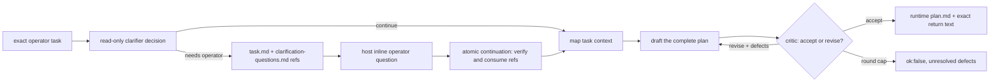

# Planning and implementation, as two workflows

`plan` turns one operator task into an accepted implementation plan.
[`plan-implement`](../plan-implement/) carries that plan out. They are two
workflows on purpose: planning is read-only and cheap to repeat, implementation
writes to the operator's checkout, and the operator decides — by launching the
second one — whether a plan is worth executing.

Both are **Package workflows**: they live in `extensions/workflows/examples/`,
which the resolver scans, so `/workflow-run plan "<task>"` and
`/workflow-run plan-implement "<request>"` resolve without any project file, and
both ship in `package.json#files` and `public-repository.json`. Workflow
JavaScript is trusted local code with full Node.js host access; it is not
sandboxed. `plan` is read-only end to end, `plan-implement` writes to the launch
checkout, and that difference is why they are two workflows rather than one.

```text
plan/
├── README.md
├── plan.workflow.mjs
├── plan-pipeline.diagram.mjs
├── plan-pipeline.excalidraw
└── plan-pipeline.png

plan-implement/
├── README.md
├── plan-implement.workflow.mjs
├── plan-implement-pipeline.diagram.mjs
├── plan-implement-pipeline.excalidraw
└── plan-implement-pipeline.png
```

The diagram triple is part of the curated contract: the `.diagram.mjs` generator
is the source of truth, and the `.excalidraw` and `.png` beside it are
regenerated from it rather than hand-edited.

There are no prompt resources and no workflow-local agent definitions. Every
stage task is written inline under one `COMMON` contract, because no prompt here
is long enough to bury the routing — the [authoring rule](../../AUTHORING.md) and
the shipped counts are in [`../README.md`](../README.md).

## `plan`: two loops with two different owners



**The operator loop runs at most once and can pause the whole run.** A read-only
clarifier returns the shaped decision `{decision, questions}`. `continue` starts
planning. `needs_operator` persists the exact task and the readable questions,
returns their complete `{ runId, artifactId, name, sha256 }` references, declares
a generic operator handoff, and stops. The answers arrive as ordinary text on a
continuation that also attaches those two references through the workflow host's
closed `continuation` field; the runtime verifies and copies both before workflow
code starts, and the entry then proves they came from this workflow's own
`clarify-task` stage before using a byte of them.

`clarification-questions.md` carries each question's id _and_ its full prompt, and
the answers are always forwarded together with the questions they answer. An
answer sheet alone — "1. yes, 2. the second one" — is unreadable to every later
stage and to every human who opens the run afterwards.

**The drafting loop runs entirely inside one run.** The drafter writes the whole
plan; a read-only critic reopens the repository, checks each step against what is
actually there, and returns `{verdict, defects}`. Script code branches on the
enum and hands the defect sentences to the next round verbatim, numbered. It
never greps the draft's Markdown.

Every round returns the complete plan, never a delta, so each round is a whole
document and the workflow never merges two model texts. Rounds share the
`plan.md` name: the artifact id is the index identity, so every round is retained
separately and the last one is the plan.

The measured exit is the critic. `MAX_PLAN_ROUNDS` (4) is only the safety net, and
reaching it is a failure — `{ ok: false, stoppedBy: "round-cap", unresolvedRows }`
carrying the critic's last defects. That is deliberate: a draft nobody accepted is
not a plan, and because continuation consumes only a _successful_ run's projected
artifacts, an unaccepted draft cannot be handed to a writer.

### What the run retains

- `task.md` — the exact operator task, byte for byte;
- `clarification-questions.md` and `clarification-answers.md` when the run paused;
- `clarifier-decision.json`, `context.md`, and one `plan.md` plus one
  `plan-critique.json` per drafting round;
- the returned text, equal to the accepted `plan.md`.

## `plan-implement`: one writer per step

```mermaid
flowchart LR
    P["verified plan.md reference"] --> S["host: parse ## Steps blocks"]
    S --> L["no-tool selector: which steps, with notes"]
    L --> V["workflow: validate ids, restore plan order"]
    V --> R["resolve implementation scope (read-only)"]
    R --> W1["writer: step S1"]
    W1 --> W2["writer: step S2"]
    W2 --> E["collect check evidence (read-only + repository_check)"]
    E --> Q["fresh reporter (read-only)"]
    Q --> O["runtime implementation-report.md"]
```



The plan arrives as host-verified bytes, never as text pasted into the input. The
entry requires exactly one continuation artifact named `plan.md` and proves four
things about it: it came from the `plan` workflow, from its `draft-plan` stage, as
an automatic answer, and `terminal.result` equals these exact bytes. That last
check is the load-bearing one — it is what distinguishes the accepted plan from a
same-named draft written by an earlier round of the same loop.

Deterministic code then parses the `### S<n>` blocks. That text was written by a
_previous_ run's agent, so a malformed plan is a fatal error: nobody in this run
can be re-asked for it. Everything the current run's selector can repair —
choosing ids that exist, staying inside the note budget — is a schema keyword or a
`validate` callback instead, and is re-asked rather than fatal.

The selector may implement a subset when the operator asked for one, but the
**plan's own order is authority**: `orderStepSelection` restores it regardless of
the order the selector listed. Each writer receives exactly one step block, its
operator note, the shared scope, and its predecessors' results.

A failing writer stops the remaining steps — plan steps are ordered because each
builds on the last, and running the rest on top of a failure is how a plan
half-lands — but it does not stop the run. The checker and the reporter still run,
because the operator's working tree has already changed and needs describing, and
the run returns `{ ok: false, partial: true, appliedSteps, failedStep,
unresolvedRows }`. The runner projects a deliberate partial as a non-success.

`captureSourceState()` fingerprints the checkout before and after every writer, so
the reporter can separate what a declared writer window changed from drift that
appeared outside one. It records evidence; it does not lock the checkout.

### What the run retains

- `step-selection.json`, `scope.md`, one `worker-S<n>.md` per attempted step,
  `check-evidence.md`, and `implementation-report.md`;
- `source-state-*.json` fingerprints around every writer and check window;
- the returned text, equal to `implementation-report.md`, unless the run was
  partial — then the returned value is the structured envelope above and the
  report is still retained.

## Capability boundary

Capability policy lives in the workflow scripts, not in prompt prose. Every stage
of `plan` passes `readOnly: true`, which the host enforces by removing shell,
write/edit, nested workflow, and unknown tools — planning cannot change the
repository. In `plan-implement` only the per-step writers hold `write`, `edit`,
and `bash`; the selector has no tools at all, and the scope, check, and report
stages are read-only. The check stage additionally receives `repository_check`,
which runs an existing `package.json` script in a disposable host-created
worktree with host-owned argv, timeout, and cleanup.

Neither workflow commits, pushes, stages, stashes, or touches a remote.
