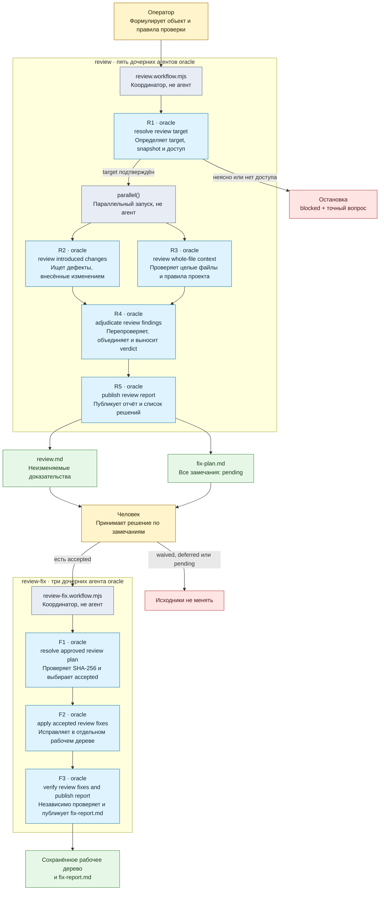

# Текущий алгоритм review workflow

Этот документ описывает текущую реализацию двух связанных пакетных workflows:

- `review` выполняет проверку кода без исправления исходников;
- `review-fix` применяет только явно принятые человеком замечания в отдельном
  рабочем дереве Git.

Источники истины:

- [`agents.yaml`](./agents.yaml) — имена, номера, параметры и prompts агентов;
- [`review.workflow.mjs`](../review/review.workflow.mjs) — схемы и маршрутизация review;
- [`review-fix.workflow.mjs`](../review-fix/review-fix.workflow.mjs) — схемы и маршрутизация исправлений;
- [`review-config.mjs`](./review-config.mjs) — проверка и подстановка YAML-конфигурации.

## Структура каталогов

```text
extensions/workflows/examples/
├── review/
│   ├── review.workflow.mjs
│   └── review-pipeline.*
├── review-fix/
│   ├── review-fix.workflow.mjs
│   └── review-fix-pipeline.*
└── review-family/
├── README.md
├── agents.yaml
├── review-config.mjs
└── review-c4-components.*
```

`review` и `review-fix` — самостоятельные Package workflows, поэтому их
entrypoints и собственные диаграммы не лежат в одном каталоге. Нейтральный
`review-family/` временно содержит только общие определения и документацию,
которые используют оба workflow.

Workflow-код больше не содержит длинные prompts агентов. В `agents.yaml` для
каждой роли указаны:

- `id` — короткое обозначение на схеме: `R1`–`R5` или `F1`–`F3`;
- `number` — порядковый номер внутри своего workflow;
- `name` — устойчивое человекочитаемое имя;
- `label` — фактическая метка дочерней сессии в runtime;
- `profile` — профиль агента, сейчас `oracle`;
- `schema` — имя ожидаемой схемы результата;
- `permissionMode`, `workspaceMode` и `maxToolCalls`;
- `prompt` — полный шаблон инструкции агенту.

Динамические данные подставляются только в явные переменные вида
`{{ORIGINAL_REQUEST}}`, `{{TARGET_JSON}}` и `{{RESULT_ENVELOPE}}`. Загрузчик
останавливает импорт при неизвестной структуре, пропущенной роли, нарушенном
порядке номеров, дублирующемся `id` или `label`, неверном профиле, неизвестной
схеме на точке вызова либо незаполненной переменной шаблона.

## Коротко

`review` получает свободно сформулированный запрос, точно определяет объект
проверки, запускает две независимые линии анализа, перепроверяет их выводы
отдельным агентом и публикует:

1. `review.md` — неизменяемое заключение с доказательствами;
2. `fix-plan.md` — редактируемый человеком список решений по замечаниям.

Сам `review` исходный код не меняет. Исправления начинаются только после
решения человека и отдельного запуска `review-fix`.



Обозначения `R1`–`R5` и `F1`–`F3` — стабильные ID агентов из `agents.yaml`.
Вторая строка каждого голубого узла содержит имя агента, следующая строка —
его конкретный шаг. Голубые узлы — агенты, серые — код координации, жёлтые — действия
человека, зелёные — сохранённые артефакты, красные — остановка без изменения
исходников.

## Как запускаем

Пример для текущей ветки:

```text
/workflows run review "Проверь текущую ветку относительно dev"
```

Пример для pull request:

```text
/workflows run review "Проверь PR ACME/private-repo#918 по правилам репозитория"
```

Вход после имени workflow — обычный текст. У `review` нет собственного языка
флагов для ветки, pull request или конкретного Git-сервиса.

## Алгоритм `review`

### R1. Определить точный объект проверки

Первый полный агент `oracle`, то есть дочерняя сессия со своими инструментами,
получает исходный запрос и сам:

1. Проверяет текущий каталог, состояние Git, удалённые репозитории и правила
   проекта.
2. Использует уже доступные локальные инструменты и авторизацию, в том числе
   для приватного Git-сервиса, не печатая секреты.
3. Разрешает точное сравнение: ветки, коммиты, рабочее дерево или pull request.
4. Формирует:
   - `target` — что именно сравниваем;
   - `snapshot` — какие точные байты проверяем, обычно через хэши коммитов;
   - `constraints` — применимые правила и ограничения.

Агент ничего не редактирует, не переключает ветки и не меняет состояние
удалённого репозитория.

Если target неоднозначен или недоступен, workflow прекращается со статусом
`blocked` и одним точным вопросом оператору. Следующие агенты не запускаются.

### R2 и R3. Выполнить две независимые проверки параллельно

После подтверждения target workflow запускает два новых полных агента
`oracle`. Каждый повторно открывает target своими инструментами и самостоятельно
получает diff, то есть разницу между версиями, и необходимые файлы.

#### Линия A: изменения

Проверяет прежде всего проблемы, внесённые рассматриваемым изменением:

- корректность;
- безопасность;
- тесты;
- интеграцию между компонентами;
- затронутых потребителей за пределами изменённых строк.

Замечания только про стиль не создаются.

#### Линия B: полный контекст

Проверяет изменение в контексте репозитория:

- полные версии изменённых файлов;
- правила и стандарты репозитория;
- конфигурацию, типы и общие утилиты;
- соседний код и прямых потребителей;
- тесты и документацию;
- архитектуру и сопровождаемость.

Явные правила репозитория считаются обязательным договором проверки.

#### Общие правила сбора доказательств

Обе линии:

1. Начинают с инвентаризации точного diff через `--name-status`, `--numstat`
   и `--stat`.
2. Просматривают каждый изменённый путь хотя бы на уровне инвентаря и разницы.
3. Для каждого замечания и архитектурного вывода читают полный отслеживаемый
   файл.
4. Группируют механические удаления, сгенерированные файлы, lock-файлы и
   повторяющиеся копии вместо бессмысленного чтения каждого файла отдельно.
5. Не используют `.tasks/`, `.locus/`, старые review-отчёты, журналы агентов и
   исторические планы как доказательства о проверяемом коде.
6. Не выдумывают выводы при нехватке доступа или доказательств: ограничение
   записывается явно.

Каждая линия возвращает типизированный результат:

- `verdict`: `pass`, `needs_changes` или `blocked`;
- замечания с категорией, областью происхождения `scope`, приоритетом, точным
  файлом и диапазоном строк;
- доказательство, влияние и дискретную рекомендацию исправления;
- результаты независимых проверок;
- просмотренные файлы и оставшиеся ограничения.

`scope=introduced` разрешён только при доказанном появлении проблемы в
проверяемом сравнении. Иначе используется `pre-existing`.

Если одна параллельная линия технически падает или нарушает схему результата,
группа завершается ошибкой. Согласование неполного набора замечаний не
продолжается.

### R4. Независимо согласовать итоговые замечания

Четвёртый агент `oracle` получает результаты обеих линий как данные, а не как
инструкции. Он заново открывает target и:

1. Перепроверяет каждое предложенное замечание по diff, полному файлу,
   потребителям и правилам репозитория.
2. Отбрасывает неподтверждённые замечания.
3. Объединяет дубликаты с одной корневой причиной.
4. Исправляет ошибочно указанные область происхождения `scope` и приоритет
   `severity`.
5. Добавляет критическое упущение, если обнаруживает его при перепроверке.
6. Отдельно сверяет прежние утверждения оператора и классифицирует их как:
   `current`, `fixed`, `stale`, `other_branch` или `not_reproduced`.
7. Сохраняет реальный результат каждой проверки. Незапущенная проверка
   получает `not_run` и причину, а не вымышленный успех.
8. Записывает непроверенные поверхности как остаточные риски.

Итоговый verdict определяется так:

- `blocked` — target нельзя надёжно проверить;
- `needs_changes` — осталось хотя бы одно замечание, требующее действия, со
  `scope=introduced`;
- `pass` — таких внесённых замечаний нет.

Замечания `pre-existing` остаются видимыми, но сами по себе не блокируют
проверяемое изменение.

### R5. Опубликовать человеческий отчёт и список решений

Пятый агент `oracle` не выполняет ещё одно review. Он механически публикует уже
согласованный результат:

1. Проверяет через `git check-ignore`, что `.tasks/` в проекте запуска
   действительно игнорируется Git.
2. Создаёт одну локальную review-задачу со статусом `review`.
3. Записывает основной отчёт:
   `.tasks/<task>/artifacts/review.md`.
4. Сохраняет в отчёте:
   - подтверждённые target и snapshot;
   - verdict;
   - новые замечания;
   - сверку прежних утверждений;
   - независимо выполненные проверки;
   - остаточные риски и покрытие.
5. Если замечания есть, создаёт рядом `fix-plan.md`.
6. Копирует каждое замечание в `fix-plan.md` ровно один раз и задаёт
   `Disposition: pending`.
7. Повторно читает созданные файлы, вычисляет их SHA-256 и записывает пути,
   хэши, target, snapshot и идентификаторы замечаний в `task.md`.

Агент-публикатор не вправе добавлять, удалять, объединять или переосмысливать
замечания. Он также не придумывает шаги реализации и решения о принятии.

Если замечаний нет, `fix-plan.md` не создаётся.

Если `.tasks/` не игнорируется или артефакты нельзя доказуемо записать и
перечитать, публикация возвращает `blocked` без изменения `.gitignore` и
отслеживаемых файлов.

### Координатор. Вернуть машинный результат

Workflow возвращает:

- подтверждённый target;
- итоговый review и verdict;
- сведения о публикации;
- краткое доказательство каждой стадии, включая идентификатор дочерней сессии,
  модель и статус.

Среда выполнения сохраняет ход запуска в
`.locus/runtime/workflows/<runId>/journal.ndjson`, а финальный результат — в
`result.json`.

Важно: `status=completed` означает, что алгоритм review успешно дошёл до конца
и опубликовал результат. Это не означает, что код одобрен:

- `verdict=needs_changes` тоже может сопровождаться `status=completed`;
- решение о принятии замечаний и исправлений всё ещё принадлежит человеку.

## Текущие операционные лимиты

- Агент определения target и агент публикации получают не более 80 вызовов
  инструментов каждый.
- Два проверяющих агента и итоговый согласующий агент получают не более 100
  вызовов инструментов каждый.
- Каждая независимая линия возвращает не более 30 замечаний.
- Лимиты служат аварийным ограничителем. Если поверхность слишком велика,
  агент должен явно записать непроверенные менее рискованные части в
  ограничения, а не создавать видимость полного покрытия.

## Решение человека

`review.md` считается неизменяемым доказательством. Его SHA-256 зафиксирован в
`task.md`.

Человек редактирует только `fix-plan.md` и для каждого замечания выбирает:

- `accepted` — разрешить исправление;
- `waived` — осознанно не исправлять;
- `deferred` — отложить;
- `pending` — решение ещё не принято.

Удалённое, отсутствующее или оставленное `pending` замечание не даёт права
менять исходники.

## Продолжение: алгоритм `review-fix`

`review-fix` — отдельный workflow из трёх последовательных агентов.

### F1. Проверить список решений

Первый агент:

1. Находит ровно одну review-задачу, `review.md` и `fix-plan.md`.
2. Пересчитывает SHA-256 неизменяемого `review.md` и сверяет его с `task.md`.
3. Проверяет происхождение `fix-plan.md`, target, snapshot и неизменность
   идентичности каждого замечания.
4. Принимает только явные `accepted`.
5. Относит `waived`, `deferred`, `pending`, отсутствующие и удалённые пункты к
   игнорируемым.
6. Блокирует запуск при неизвестном значении `Disposition`, дубликате,
   неизвестном идентификаторе со статусом `accepted`, изменённом review или
   подменённом snapshot.

Без хотя бы одного `accepted` workflow останавливается до записи исходников.

### F2. Исправить только принятые замечания

Второй агент:

1. Создаёт новое связанное рабочее дерево Git на точном проверенном snapshot.
2. Доказывает, что это рабочее дерево связано с репозиторием и отличается от
   исходного рабочего дерева.
3. Последовательно применяет только `accepted` замечания в порядке
   `fix-plan.md`.
4. После каждого исправления запускает узкую проверку, затем доступные
   релевантные регрессионные проверки.
5. Оставляет HEAD неизменным: commit создавать запрещено.

Исходное рабочее дерево не редактируется. Push, pull request, merge, deploy и
изменение удалённых репозиториев запрещены.

### F3. Независимо проверить исправления

Третий агент:

1. Повторно проверяет идентичность рабочего дерева и точный snapshot.
2. Убеждается, что исходное рабочее дерево не изменено и новый commit не
   создан.
3. Читает полный diff и затронутые файлы.
4. Повторно запускает проверки, необходимые для доказательства каждого
   исправления.
5. Публикует `.tasks/<task>/artifacts/fix-report.md`.
6. Оставляет локальную задачу в статусе `review`, а рабочее дерево —
   сохранённым и незакоммиченным для решения оператора.

Итог:

- `completed` — все принятые замечания доказуемо исправлены;
- `partial` — часть результата доказана, но остались точные нерешённые пункты;
- `blocked` — безопасный результат подтвердить нельзя.

## Границы доверия

- Скрипты `review` и `review-fix` используют `agent()`, `parallel()` при
  необходимости, `phase()` и `log()` для исполнения, а также импортируют
  локальный загрузчик конфигурации.
- Загрузчик из `review-family/` читает только пакетный `agents.yaml` рядом с
  собой и проверяет его схему. Он не читает проверяемый репозиторий и не
  выполняет сетевые запросы.
- В workflow нет прямых адаптеров к Git или Git-сервису и нет прямого
  `llm()`-слияния результатов.
- Доступ к репозиторию и доказательствам принадлежит полным дочерним агентам.
- Оба entry-модуля честно объявляют `identityCoverage: "entry-only"`: SHA-256
  запуска связывает entry-файл, но не байты `review-config.mjs` и `agents.yaml`.
  Поэтому три Package-каталога review family нужно рассматривать и проверять
  как один комплект.
- `permissionMode: "agent-defined"` описывает ожидаемый режим, но не создаёт
  изолированную среду.
- Запреты в инструкциях агентам — договор поведения, а реальной границей
  принуждения остаётся подтверждение запуска инструментов Pi.
- Ошибка агента, несоответствие схемы, неоднозначный target или недоказанная
  публикация приводят к остановке, а не к условному успеху.
