# Как работает review workflow

В пакете есть два связанных workflow:

- `review` проверяет код и публикует замечания;
- `review-fix` применяет только те замечания, которые человек явно отметил
  как `accepted`.

Главное правило: дочерний агент возвращает обычный текст. Workflow передаёт
этот текст следующему агенту без `JSON.parse`, схемы результата и скрытой
обёртки.

## Где лежат файлы

```text
extensions/workflows/examples/
├── review/
│   ├── README.md
│   ├── review.workflow.mjs
│   ├── review-pipeline.diagram.mjs
│   ├── review-pipeline.excalidraw
│   ├── review-pipeline.png
│   └── resources/
│       ├── target-resolver.agent.md
│       ├── target-resolver.prompt.md
│       ├── change-review.agent.md
│       ├── change-review.prompt.md
│       ├── context-review.agent.md
│       ├── context-review.prompt.md
│       ├── adjudicator.agent.md
│       ├── adjudicator.prompt.md
│       ├── publisher.agent.md
│       └── publisher.prompt.md
└── review-fix/
    ├── review-fix.workflow.mjs
    ├── review-fix-plan.mjs
    ├── review-fix-pipeline.diagram.mjs
    ├── review-fix-pipeline.excalidraw
    ├── review-fix-pipeline.png
    └── resources/
        ├── implementer.agent.md
        ├── implementer.prompt.md
        ├── verifier.agent.md
        └── verifier.prompt.md
```

Файл `*.agent.md` — настоящий агент: обычный Markdown с front matter и
инструкцией. Файл `*.prompt.md` — конкретное задание для одного шага workflow.
Это не шаблоны для будущих workflow, а реальные ресурсы текущего запуска.

Пути вида `./resources/...` считаются от исходного файла workflow. Текущий
каталог запуска на них не влияет. Runtime проверяет, что путь не выходит из
каталога workflow, один раз читает байты и сохраняет в каталоге запуска
неизменяемую копию с SHA-256.

## Общая схема

```mermaid
flowchart LR
    U["Оператор: что проверить"]

    subgraph R["Workflow: review"]
        R1["Агент R1<br/>review-01-target-resolver<br/>Определяет точный target"]
        P["Workflow<br/>Запускает R2 и R3 параллельно"]
        R2["Агент R2<br/>review-02-change-review<br/>Проверяет внесённые изменения"]
        R3["Агент R3<br/>review-03-context-review<br/>Проверяет полный контекст"]
        R4["Агент R4<br/>review-04-adjudicator<br/>Перепроверяет замечания"]
        R5["Агент R5<br/>review-05-publisher<br/>Публикует review.md"]

        R1 -->|"точный текст targetText"| P
        P --> R2
        P --> R3
        R2 -->|"точный текст changesText"| R4
        R3 -->|"точный текст contextText"| R4
        R4 -->|"точный текст adjudicatedText"| R5
    end

    U --> R1
    R5 -->|"review.md"| H["Человек: редактирует fix-plan.md"]

    subgraph F["Workflow: review-fix"]
        V["Workflow<br/>Детерминированно проверяет план и SHA-256"]
        W["Workflow<br/>Создаёт один workspaceHandle"]
        F1["Агент F1<br/>review-fix-01-implementer<br/>Исправляет accepted"]
        F2["Агент F2<br/>review-fix-02-verifier<br/>Проверяет и пишет fix-report.md"]

        V --> W --> F1
        F1 -->|"точный текст implementationText"| F2
    end

    H -->|"явный путь к fix-plan.md"| V
```



## Алгоритм `review`

Запуск:

```text
/workflows run review "Проверь текущую ветку относительно dev"
```

### 1. R1 определяет объект проверки

Workflow загружает:

- `target-resolver.agent.md`;
- `target-resolver.prompt.md`.

Агент проверяет Git, правила проекта, доступные remotes и указанный объект. Он
возвращает читаемый текст с точным сравнением и неизменяемым снимком, обычно
`base=<commit> head=<commit>`.

Workflow не разбирает слова `ready`, `blocked`, ветки или хэши из ответа. Весь
ответ становится строкой `targetText`.

### 2. R2 и R3 проверяют код независимо

Workflow параллельно создаёт два дочерних агента.

- R2 ищет дефекты, внесённые проверяемым изменением.
- R3 читает полные файлы, правила, тесты, конфигурацию и прямых потребителей.

Оба получают исходный запрос и `targetText`. Каждый повторно открывает target
своими инструментами. Ответы сохраняются как `changesText` и `contextText`
без преобразования.

Если один дочерний запуск технически завершился ошибкой, пустым ответом,
отменой или блокировкой runtime, общий параллельный этап завершается ошибкой
после остановки второго запуска. Свободный текст агента не используется как
технический статус.

### 3. R4 перепроверяет обе линии

R4 получает:

- исходный запрос;
- `targetText`;
- точный `changesText`;
- точный `contextText`.

Он заново открывает код, проверяет каждое предложенное замечание, удаляет
дубли и формирует один полный Markdown-отчёт. Workflow считает весь ответ
строкой `adjudicatedText`.

### 4. R5 публикует результат

R5 получает `targetText` и `adjudicatedText`. Он:

1. Проверяет, что `.tasks/` игнорируется Git.
2. Создаёт локальную review-задачу.
3. Пишет `artifacts/review.md`.
4. При наличии замечаний пишет `artifacts/fix-plan.md`.
5. Для каждого замечания ставит начальное решение `pending`.
6. Записывает пути и SHA-256 в раздел `## Review Evidence` файла `task.md`.
7. Повторно читает созданные файлы и проверяет хэши.

Точный финальный текст R5 становится результатом workflow. Пути дочерней
сессии, хэши ресурсов и технические статусы runtime хранятся отдельно в
`journal.ndjson` и `result.json`.

## Решение человека

`fix-plan.md` поддерживает четыре значения:

- `accepted` — исправить;
- `waived` — осознанно не исправлять;
- `deferred` — перенести;
- `pending` — решение ещё не принято.

`review-fix` не запускает write-агента, пока хотя бы одно замечание не имеет
значение `accepted`.

## Алгоритм `review-fix`

Запуск принимает один явный путь:

```text
/workflows run review-fix ".tasks/T-201-code-review/artifacts/fix-plan.md"
```

### 1. Workflow проверяет план без агента

`review-fix-plan.mjs` до создания рабочего дерева:

1. Требует project-relative путь именно к `fix-plan.md`.
2. Запрещает выход за корень проекта, в том числе через symlink.
3. Повторно вычисляет SHA-256 `review.md`.
4. Сверяет target и snapshot между `review.md`, `fix-plan.md` и `task.md`.
5. Требует одинаковый набор и описание finding id.
6. Требует доказательство изменения первоначального all-pending плана.
7. Требует хотя бы один `accepted`.
8. Разрешает `head=<commit>` в настоящий Git commit.

Любая ошибка останавливает workflow до создания рабочего дерева и до запуска
write-агента.

### 2. Runtime создаёт одно рабочее дерево

Runtime создаёт linked Git worktree на точном reviewed head и возвращает
workflow непрозрачный идентификатор вида `workflow-workspace:1`.

Путь к рабочему дереву не берётся из ответа модели. Перед каждым агентом и
после завершения runtime проверяет:

- исходный checkout не изменился;
- HEAD рабочего дерева не изменился;
- идентификатор всё ещё указывает на созданное runtime рабочее дерево.

### 3. F1 применяет только `accepted`

Implementer получает одобренный план и workspace handle. Он меняет только
выделенное рабочее дерево, запускает проверки и возвращает обычный текст.
Коммиты, push, pull request, merge и deploy запрещены.

### 4. F2 независимо проверяет результат

Verifier получает тот же workspace handle и точный текст implementer. Он не
считает этот текст доказательством: повторно читает diff, полные файлы и
запускает необходимые проверки. Затем пишет `fix-report.md` и возвращает
обычный текст.

Точный текст verifier становится результатом `review-fix`. Рабочее дерево
сохраняется для решения оператора.

## Что агент возвращает

Успешный агент возвращает ровно одно значение: свой последний непустой текст.

```text
Проверил изменение. Найдено одно замечание в src/page.ts:41.
```

Даже JSON-похожий ответ остаётся обычным текстом:

```json
{ "status": "failed", "summary": "это всё ещё текст агента" }
```

Workflow не извлекает из него `status`, `summary`, пути или идентификаторы.
JSON-схема остаётся доступна только отдельному `llm()` API, когда вызывающий код
явно запросил schema validation. Она не является контрактом `agent()`.
