# Curated review workflow

The package contains two related workflows:

- `review` inspects a target and publishes review evidence;
- `review-fix` applies only findings that a human explicitly marks
  `accepted`.

The core contract is deliberately small:

1. A workflow-specific stage is one neighboring `*.prompt.md` file.
2. The prompt contains both stable role instructions and dynamic
   `{{VARIABLE}}` handoffs.
3. `agent(renderedPrompt, options)` launches a catalog agent. Omitted `agent`
   uses the catalog `default` role.
4. Capability policy remains in workflow code. `readOnly`, `tools`,
   `workspaceMode`, and `maxToolCalls` are not prompt claims.
5. A successful child returns exact non-empty text. The workflow forwards that
   text without `JSON.parse`, result schemas, or model-written envelopes.

## Files

```text
extensions/workflows/examples/
├── review/
│   ├── README.md
│   ├── review.workflow.mjs
│   ├── review-pipeline.diagram.mjs
│   ├── review-pipeline.excalidraw
│   ├── review-pipeline.png
│   └── resources/
│       ├── target-resolver.prompt.md
│       ├── change-review.prompt.md
│       ├── context-review.prompt.md
│       ├── adjudicator.prompt.md
│       └── publisher.prompt.md
└── review-fix/
    ├── review-fix.workflow.mjs
    ├── review-fix-plan.mjs
    ├── review-fix-pipeline.diagram.mjs
    ├── review-fix-pipeline.excalidraw
    ├── review-fix-pipeline.png
    └── resources/
        ├── implementer.prompt.md
        └── verifier.prompt.md
```

There are no workflow-local `*.agent.md` files. Catalog agents provide the
stable execution mechanism; neighboring prompts provide workflow-specific
behavior.

## How one stage is launched

```js
const prompt = await promptFile("./resources/change-review.prompt.md", {
  ORIGINAL_REQUEST: originalRequest,
  TARGET_TEXT: targetText,
});

const text = await agent(prompt, {
  ...REVIEW_READ_OPTIONS,
  label: "review introduced changes",
});
```

`promptFile()` resolves the path from the original workflow entry, not from the
process working directory. Runtime rejects absolute paths, lexical and symlink
escapes, missing files, wrong suffixes, missing variables, and unused
variables. It reads each prompt once, stores an immutable run copy, and records
SHA-256 evidence.

`REVIEW_READ_OPTIONS` is declared once near the top of
`review.workflow.mjs`. The 1,000-call limit is a runaway fuse, not a normal
budget. `workspaceMode: "project"` keeps inspection in the launch checkout.
`readOnly: true` causes the SDK host to remove shell, write/edit, nested
workflow, and unknown tools. Git inspection uses the allowlisted `git_read`
argv tool.

## Where `phase()` and `log()` come from

Workflow entry files do not import DSL methods at runtime. Pi passes one `dsl`
object as the first argument to `runWorkflow`.

- `WorkflowDsl` is defined in
  `extensions/_shared/workflow-runtime.ts`.
- `phase(name)` changes the visible stage and appends a `phase` journal line.
- `log(message)` appends a script-owned message under the current stage.
- The JSDoc type link above `runWorkflow` lets JavaScript-aware IDEs navigate
  from destructured DSL methods to `WorkflowDsl` without executing an import.

## Agent map

```mermaid
flowchart LR
    U["Operator: review request"]

    subgraph R["Workflow: review"]
        R1["Agent R1: resolve target<br/>read-only"]
        P["Workflow: launch R2 and R3 in parallel"]
        R2["Agent R2: inspect introduced changes<br/>read-only"]
        R3["Agent R3: inspect full repository context<br/>read-only"]
        R4["Agent R4: verify and adjudicate findings<br/>read-only"]
        R5["Agent R5: publish review artifacts<br/>write-capable"]

        R1 -->|"exact targetText"| P
        P --> R2
        P --> R3
        R2 -->|"exact changesText"| R4
        R3 -->|"exact contextText"| R4
        R4 -->|"exact adjudicatedText"| R5
    end

    U --> R1
    R5 -->|"review.md + optional fix-plan.md"| H["Human: edit dispositions"]

    subgraph F["Workflow: review-fix"]
        V["Workflow: validate plan and hashes"]
        W["Workflow: allocate one workspaceHandle"]
        F1["Agent F1: apply accepted findings"]
        F2["Agent F2: verify diff and publish fix-report.md"]

        V --> W --> F1
        F1 -->|"exact implementationText"| F2
    end

    H -->|"explicit fix-plan.md path"| V
```



## `review` algorithm

### 1. R1 resolves the target

The workflow renders `target-resolver.prompt.md`. R1 inspects Git state,
repository rules, remotes, and the requested object. It returns readable text
containing the exact comparison and an immutable snapshot, normally
`base=<commit> head=<commit>`.

The workflow does not parse `ready`, `blocked`, branch names, or hashes from
the answer. The complete answer becomes `targetText`.

### 2. R2 and R3 inspect independently

The workflow starts two child sessions behind one fail-closed parallel barrier.

- R2 focuses on defects introduced by the exact change.
- R3 reads complete files, repository rules, tests, configuration, and direct
  consumers.

Each session receives the original request and exact `targetText`, then reopens
the target with its own tools. Their final texts become `changesText` and
`contextText`.

If either child technically fails, is blocked, is cancelled, or returns empty
text, the parallel stage fails after its sibling settles. Text that merely
looks like a failure envelope is still ordinary text.

### 3. R4 adjudicates

R4 receives the original request plus exact `targetText`, `changesText`, and
`contextText`. It reopens the target, verifies proposed findings, removes
duplicates, corrects severity and scope, reconciles prior claims, and returns
one complete Markdown review as `adjudicatedText`.

### 4. R5 publishes

R5 is the only write-capable review session. It first proves `.tasks/` is
ignored, then creates one local review task and writes:

- `artifacts/review.md` with the exact adjudicated review;
- `artifacts/fix-plan.md` when actionable findings exist;
- review paths, hashes, target, snapshot, and finding ids in `task.md`.

Every new plan disposition is `pending`. R5 copies findings mechanically and
does not edit reviewed source code.

## Human approval

The operator reads immutable `review.md` and edits only the disposition in
`fix-plan.md`:

- `accepted` authorizes a source change;
- `waived` records a conscious non-fix;
- `deferred` postpones the finding;
- `pending` grants no write authority.

No remediation starts until at least one finding is `accepted`.

## `review-fix` algorithm

### 1. Deterministic validation

`review-fix-plan.mjs` validates path confinement, review and plan hashes,
target, snapshot, finding identity, proof that the plan changed after
publication, at least one accepted finding, and an addressable reviewed commit.
No child or worktree exists before this check passes.

### 2. One runtime-owned worktree

The workflow allocates one retained linked worktree at the reviewed head and
keeps only its opaque `workspaceHandle`. Model-returned paths never select the
workspace.

### 3. F1 applies accepted findings

The implementer receives immutable review text, the approved plan, accepted
ids, ignored ids, and exact hashes. It applies only accepted findings, runs
focused checks, and returns ordinary text as `implementationText`. It does not
commit, push, merge, deploy, or edit the original checkout.

### 4. F2 verifies and reports

The verifier reuses the same `workspaceHandle`. It treats
`implementationText` as a claim, reopens the actual diff, verifies each
accepted finding, and writes `artifacts/fix-report.md` plus matching task
evidence. Source changes remain uncommitted in the retained worktree.

## Output and safety boundaries

- Model output is always text. Runtime status, diagnostics, session ids, model
  data, and artifacts remain runtime-owned evidence.
- `llm({ schema })` is the separate direct-model JSON contract; `agent()` does
  not parse JSON.
- `readOnly: true` is host-enforced capability narrowing.
- `permissionMode` is trace intent, and Pi still owns operator approval.
- A worktree isolates file changes for review. It is not a security sandbox.
- Prompt restrictions guide write-capable sessions but do not replace host
  approval or deterministic validation.
