# Curated review workflow

`review` is a read-only, question-led review chain. The workflow runtime owns
its durable evidence; no model session writes or republishes reports.

The workflow receives only a non-empty semantic text string. On a fresh call, a
read-only clarifier returns the shaped decision `{decision, questions}`. A
`continue` decision starts the full review. A `needs_operator` decision persists
the exact intent and readable questions, returns their complete refs, declares a
generic actionable handoff, and stops. After Pi is idle, the oldest question
opens directly in the primary editor. Arrow/Enter selection or inline custom
text starts one host-owned continuation; bare `/workflows` reopens a question
that was dismissed with Escape.

A continuation supplies the operator's answers as ordinary text and attaches
exactly `intent.md` plus `clarification-questions.md` through the workflow
host's closed `continuation` field. The runtime verifies and copies both
same-origin refs before workflow code starts. The entry then proves that their
persisted source target was the Package workflow named `review` in
`prepare-clarification`, persists the answers, and runs the review.

Continuation never locates an artifact by run id plus a conventional filename.
The caller supplies the complete `{ runId, artifactId, name, sha256 }`
references returned by the paused call. Matching names and a successful source run
are insufficient: runtime-verified source target, artifact kind, and stage must
also match the prepare contract. The workflow declares question content, while
the generic host owns UI, FIFO ordering, claim state, and continuation launch;
there is no review-specific UI or result protocol.

## Files

```text
review/
├── README.md
├── review.workflow.mjs
├── review-pipeline.diagram.mjs
├── review-pipeline.excalidraw
├── review-pipeline.png
└── resources/
    ├── clarifier.prompt.md
    ├── scope-resolver.prompt.md
    ├── change-inventory.prompt.md
    ├── unit-planner.prompt.md
    ├── interrogator.prompt.md
    └── verifier.prompt.md
```

There are no workflow-local agent definitions. Catalog agents provide the
execution mechanism; neighboring prompt files contain the complete
workflow-specific roles and handoffs.

## Runtime-owned evidence

Every full review retains these exact texts beneath the canonical run root
`.locus/runtime/workflows/<runId>/artifacts`:

- `intent.md` for a fresh full review, or the consumed prior-run intent for continuation;
- `clarification-answers.md` for continuation;
- `scope.md`, `inventory.md`, `units.md`, and `questions.md`;
- `review.md`, byte-for-byte equal to the verifier's returned text.

The five model-authored full-review texts use `agent({ artifact })`, so the
automatic answer is the named artifact; the workflow does not publish a second
copy. The runtime index records complete references, digests, stage names,
media types, and source lineage. Exact transcripts remain separate
runtime-owned evidence. The workflow returns the verifier's exact review text;
it does not parse a model-written status, normalize the report, or return a
publisher summary.

### Artifact limits and duplicate names

Every artifact name is one ASCII path component of 1–128 characters matching
`[A-Za-z0-9][A-Za-z0-9._-]{0,127}`. Slashes, traversal, whitespace, and longer
names fail closed. Every published, consumed, or automatic text artifact is
limited to 2,097,152 UTF-8 bytes.

Logical names are labels, not lookup keys. The index identity is `artifactId`,
and more than one record may carry the same `name`; callers must retain the
complete returned reference. The shaped clarifier answer is retained once as
`clarifier-decision.json`; when it pauses, deterministic workflow code
separately publishes readable `clarification-questions.md`. Main review stages
create only their automatic named answers, avoiding duplicate model-text
publications.

## Review chain

```mermaid
flowchart LR
    P["fresh exact intent"] --> C["read-only clarifier decision"]
    C -->|"needs operator"| A["intent.md + clarification-questions.md refs"]
    C -->|"continue"| R1
    A --> H["host inline operator question"]
    H --> X["atomic continuation: verify and consume refs"]
    X --> R1["R1: resolve scope"]
    R1 --> R2A["R2a: inventory changes"]
    R2A --> R2B["R2b: plan review units"]
    R2B --> R3["R3: ask falsifiable questions"]
    R3 --> R4["R4: verify and write review"]
    R4 --> O["runtime review.md + exact return text"]
```



All six model roles, including the optional clarification planner, are
host-enforced read-only. Scope and inventory use `read`, `git_read`, `grep`,
and `find`. Unit planning, interrogation, and verification also receive the
allowlisted `ast_index` tool, with direct-read and text-search fallback.

The original intent text is inserted unchanged into every full-review prompt.
Later stages receive both that intent and the exact preceding handoffs. This
prevents scope resolution from silently replacing the operator's focus.

### R1: resolve scope

R1 combines the exact intent with any persisted clarification, inspects Git
state and repository guidance, and returns one explicit target, inclusion,
exclusion, and focus contract.

### R2a: inventory changes

R2a maps every changed surface in scope, including staged, unstaged, and
untracked work where applicable. It assigns stable `C<n>` coverage ids and owns
coverage, not judgment.

An empty scope is a legitimate inventory answer, not a defect: when nothing
changed — a clean worktree under an unstaged-changes scope, for example — R2a
returns the explicit `## No changes` declaration with its reason, and the run
completes there with a `no-changes` result instead of failing. The two shapes are
mutually exclusive, and an answer with neither stops the review with a message
naming this stage and its prompt.

### R2b: plan review units

R2b groups the inventory by material decision rather than filename. Every
inventory id belongs to exactly one unit and remains unchanged.

### R3: ask review questions

R3 receives the original inventory as well as the units, reports any dropped or
duplicated coverage id, then asks the smallest set of concrete, falsifiable
questions that could change acceptance. It does not answer them or write
findings. Its reconciliation uses exactly one `C<n>: U<n>; ...` row per
inventory id.

### R4: verify and author the report

R4 receives the original inventory, units, and questions. It independently
reopens code, callers, tests, configuration, and applicable documentation,
accounts for every `C<n>` id with the same exact ledger grammar and assigned
unit, answers every question, and promotes only
reachable, root-cause-deduplicated problems to findings. Its exact Markdown
becomes both the workflow result and `review.md`.

## Prompt and capability boundary

`promptFile()` resolves from the original workflow entry. The runtime rejects
absolute paths, lexical and symlink escapes, missing files, wrong suffixes,
missing variables, and unused variables. It snapshots each prompt and records
digest evidence.

Capability policy lives in `review.workflow.mjs`, not prompt prose.
`readOnly: true` removes shell, write/edit, nested workflow, and unknown tools.
The high tool-call limit is a runaway fuse. `workspaceMode: "project"` means
review agents inspect the launch checkout.

`phase()` and `log()` come from the injected `WorkflowDsl`; the entry imports
no runtime implementation. Plain `agent()` returns exact non-empty text. Only
the clarifier uses the runtime's fail-closed shaped `agent({schema})` boundary;
deterministic code adds question count, uniqueness, and text limits. The
workflow uses no local JSON parser, marker protocol, or interactive ask tool.

Remediation remains a separate, explicitly started `review-fix` workflow. A
review run grants no source-write authority.
